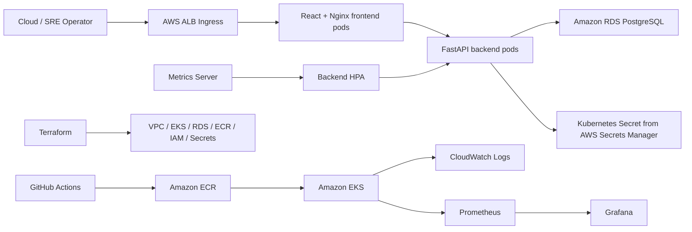

# CloudOps SRE Platform

CloudOps SRE Platform is a cloud-native reliability operations dashboard built for Amazon EKS. It tracks service health, deployments, incidents, MTTR, and SLO-style reliability metrics while demonstrating production-style Kubernetes deployment, CI/CD, autoscaling, observability, and infrastructure as code.

## What This Demonstrates

- Production-style containerized app with React, FastAPI, PostgreSQL, Docker, and Nginx
- Kubernetes packaging with Helm, probes, resource limits, HPA, services, and ALB ingress
- AWS foundation with Terraform for VPC, EKS, ECR, RDS, IAM, Secrets Manager, and CloudWatch
- CI/CD with GitHub Actions for tests, builds, image publishing, Terraform validation, and gated EKS deployment
- SRE workflows for services, incidents, timelines, deployments, MTTR, HPA scale-out, CloudWatch logs, and Grafana proof
- Cost-controlled AWS demo workflow designed to deploy, capture evidence, and destroy the same day

## Project Status

Validated project components:

- FastAPI backend and React frontend
- PostgreSQL schema and seeded data
- Local Docker Compose stack
- Production-style Nginx Docker stack
- Backend API tests
- Frontend production build
- Terraform AWS foundation
- Helm chart
- GitHub Actions workflows
- AWS add-on prep docs
- HPA/k6 load-test proof assets
- Observability evidence runbooks

Short-lived AWS demo workflow:

- `terraform apply`
- ECR image push
- EKS deployment
- AWS screenshots
- `terraform destroy`

Run the AWS workflow only when ready to capture proof and destroy the environment the same day.

## Architecture



More detail: [docs/architecture.md](docs/architecture.md)

## Application Features

- Dashboard with service, incident, deployment, MTTR, and platform status metrics
- Service catalog with owner, environment, SLO target, status, version, and URL
- Incident workflow with severity, status, timeline updates, and resolution
- Deployment history with version, commit SHA, status, and deployment time
- Metrics endpoint for reliability dashboard summaries
- Bounded CPU demo endpoint for HPA proof: `/demo/cpu`

## Repository Structure

```text
.
├── backend/                 # FastAPI, SQLAlchemy, tests, Dockerfile
├── frontend/                # React, Vite, Nginx production image
├── infra/                   # Terraform AWS foundation
├── charts/                  # Helm chart for EKS deployment
├── load-tests/              # k6 HPA load test
├── docs/                    # Architecture, deployment, runbooks, evidence
├── .github/workflows/       # CI/CD and Terraform validation
├── docker-compose.yml       # Local dev stack
└── docker-compose.prod.yml  # Production-style local stack
```

## Local Development

Prerequisite:

- Docker Desktop running

Start the dev stack:

```bash
docker compose up -d --build
docker compose ps
```

Expected:

- PostgreSQL: `localhost:5432`
- FastAPI: `http://localhost:8000`
- React/Vite: `http://localhost:5173`

Verify:

```bash
curl http://localhost:8000/health
curl http://localhost:8000/metrics
```

Run tests and frontend build:

```bash
docker compose exec backend pytest -q
docker compose exec frontend npm run build
```

Expected:

```text
5 passed
✓ built
```

## Production-Style Local Docker

This stack validates the pattern used later for EKS: React builds into static assets, Nginx serves the frontend, and `/api/*` proxies to FastAPI.

```bash
docker compose -f docker-compose.prod.yml up -d --build
docker compose -f docker-compose.prod.yml ps
```

Open:

```text
http://localhost:8080
```

Verify Nginx API proxy:

```bash
docker compose -f docker-compose.prod.yml exec frontend wget -qO- http://127.0.0.1/api/health
docker compose -f docker-compose.prod.yml exec frontend wget -qO- 'http://127.0.0.1/api/demo/cpu?duration_ms=10'
```

## Terraform Validation

Terraform defines:

- VPC, subnets, Internet Gateway, NAT Gateway, route tables
- EKS cluster, managed node group, core add-ons, OIDC provider
- ECR repositories
- RDS PostgreSQL
- Secrets Manager database secret
- IAM roles and policies
- AWS Load Balancer Controller IRSA role
- CloudWatch log groups and alarm

Validate only:

```bash
terraform -chdir=infra init -backend=false
terraform -chdir=infra fmt -check -recursive
terraform -chdir=infra validate
```

Expected:

```text
Success! The configuration is valid.
```

Do not run `terraform apply` until the deploy-day checklist is complete.

## Helm Validation

If Helm is installed:

```bash
helm lint charts/cloudops-sre-platform -f charts/cloudops-sre-platform/values-aws-example.yaml
helm template cloudops charts/cloudops-sre-platform -f charts/cloudops-sre-platform/values-aws-example.yaml --namespace cloudops
```

If Helm is not installed:

```bash
docker run --rm \
  -v "$PWD:/workspace" \
  -w /workspace \
  alpine/helm:3.15.4 lint charts/cloudops-sre-platform \
  -f charts/cloudops-sre-platform/values-aws-example.yaml
```

Expected:

```text
1 chart(s) linted, 0 chart(s) failed
```

## CI/CD

Workflows:

- [.github/workflows/terraform-validate.yml](.github/workflows/terraform-validate.yml)
- [.github/workflows/deploy.yml](.github/workflows/deploy.yml)

Default CI checks:

- Backend tests
- Frontend production build
- Docker image builds
- Helm lint and render
- Terraform validate

AWS deployment is manual only and requires:

```text
deploy_to_aws = true
```

Required future GitHub secrets:

```text
AWS_ROLE_TO_ASSUME
AWS_DATABASE_SECRET_NAME
```

More detail: [docs/ci-cd.md](docs/ci-cd.md)

## HPA Load Test

Smoke-test the local load path:

```bash
docker run --rm \
  -e BASE_URL="http://host.docker.internal:8080" \
  -e TARGET_PATH="/api/demo/cpu" \
  -e CPU_DURATION_MS="10" \
  -e SMOKE_TEST="true" \
  -v "$PWD/load-tests:/scripts" \
  grafana/k6:0.54.0 run /scripts/k6-load-test.js
```

Expected:

```text
checks: 100%
```

Full AWS HPA proof: [docs/hpa-demo.md](docs/hpa-demo.md)

## AWS Demo Day

The AWS deployment is intended to be short-lived. Do not leave these resources running overnight:

- EKS cluster and worker nodes
- RDS PostgreSQL
- NAT Gateway
- Application Load Balancer
- CloudWatch log ingestion

Before deploying:

1. Run all local validation checks.
2. Confirm AWS account and region.
3. Run `terraform plan`.
4. Review cost-bearing resources.
5. Apply only when ready to capture screenshots.
6. Destroy the same day.

Checklist: [docs/aws-demo-checklist.md](docs/aws-demo-checklist.md)

## Evidence To Capture

- Live app dashboard on ALB URL
- Services page
- Incident detail timeline
- Deployment history
- GitHub Actions successful workflow
- ECR backend/frontend images
- EKS cluster and nodes
- `kubectl get pods,svc,ingress,hpa`
- HPA before/during/after k6 load
- Grafana CPU/HPA graphs
- CloudWatch backend/frontend logs
- Terraform apply output
- Terraform destroy confirmation

Evidence guide: [docs/evidence.md](docs/evidence.md)

## Documentation

- [Architecture](docs/architecture.md)
- [Deployment](docs/deployment.md)
- [AWS Add-ons](docs/aws-addons.md)
- [CI/CD](docs/ci-cd.md)
- [HPA Demo](docs/hpa-demo.md)
- [Observability](docs/observability.md)
- [Runbook](docs/runbook.md)
- [Cost Control](docs/cost-control.md)
- [Evidence Checklist](docs/evidence.md)
