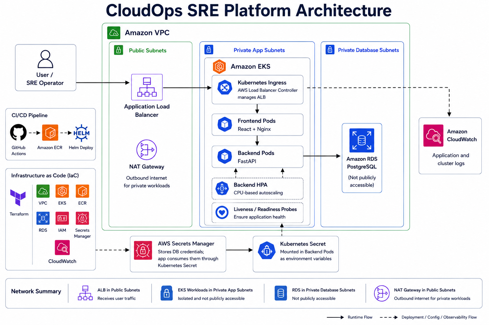
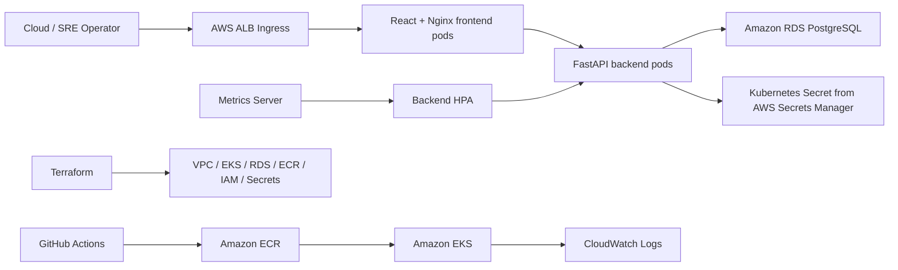
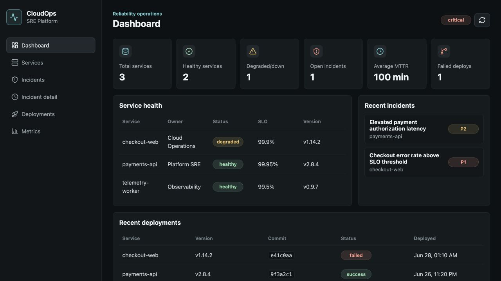
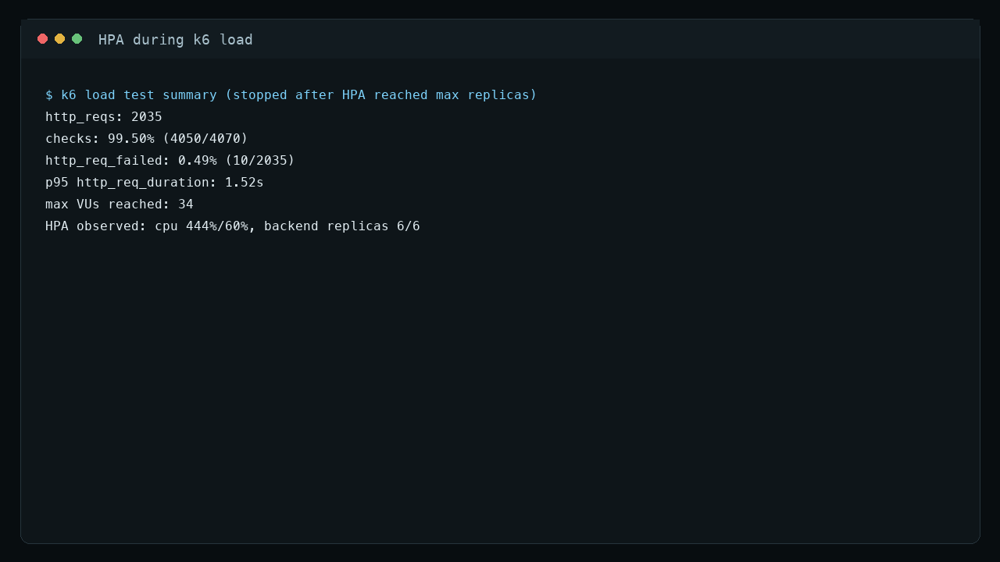
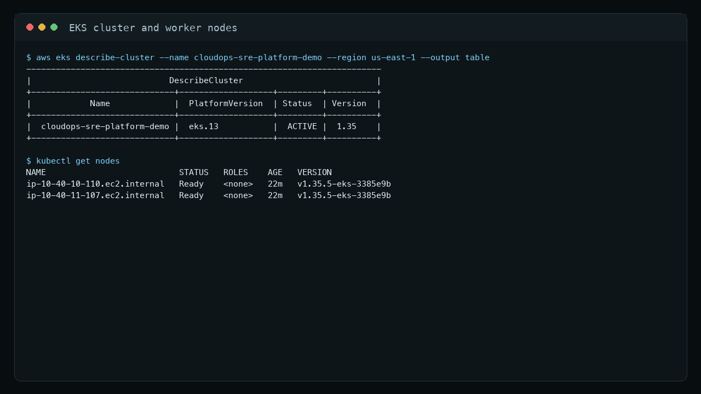
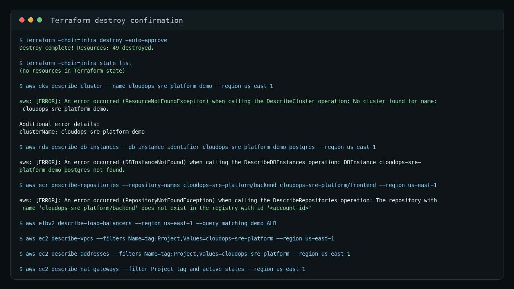

# CloudOps SRE Platform

CloudOps SRE Platform is a cloud-native reliability operations dashboard built on Amazon EKS. It tracks service health, deployments, incidents, MTTR, and SLO-style reliability metrics for teams that need a clear view of operational health.

## Why I Built This

Before moving deeper into cloud infrastructure, I worked in production network operations where incidents were real, SLAs mattered, and every handoff needed enough context for the next engineer to keep troubleshooting without losing time. That experience shaped how I think about reliability: service health, deployment history, timelines, ownership, and recovery metrics should be visible in one place.

This project is my bridge from network operations to cloud operations. I built the kind of internal SRE console I would want during a live incident: one place to register services, track health, record deployment changes, manage incident timelines, and understand MTTR.

The AWS demo deployed the application on Amazon EKS using Kubernetes Deployments, Services, ALB Ingress, Helm, HPA autoscaling, ECR images, Amazon RDS PostgreSQL, Secrets Manager, CloudWatch logs, and Terraform-managed infrastructure. The environment was destroyed after the demo to avoid ongoing cost.

Demo notes and screenshots:

- [AWS demo run summary](docs/demo-proof.md)
- [Screenshot gallery](docs/screenshots/aws-demo-2026-06-06/README.md)

## What I Built Into It

- Production-style containerized app with React, FastAPI, PostgreSQL, Docker, and Nginx
- Kubernetes packaging with Helm, probes, resource limits, HPA, services, and ALB ingress
- AWS foundation with Terraform for VPC, EKS, ECR, RDS, IAM, Secrets Manager, and CloudWatch
- CI/CD with GitHub Actions for tests, builds, image publishing, Terraform validation, and gated EKS deployment
- SRE workflows for services, incidents, timelines, deployments, MTTR, HPA scale-out, CloudWatch logs, and observability runbooks
- Optional Prometheus/Grafana add-on notes for deeper Kubernetes metrics beyond the completed CloudWatch/HPA demo
- Cost-controlled AWS demo workflow designed to deploy, document the run, and destroy the same day

## Current State

Working project components:

- FastAPI backend and React frontend
- PostgreSQL schema and seeded data
- Local Docker Compose stack
- Production-style Nginx Docker stack
- Backend API tests
- Frontend production build
- Terraform AWS foundation
- Helm chart
- GitHub Actions workflows
- AWS add-on prep docs
- HPA/k6 load-test notes and screenshots
- Observability runbooks

Short-lived AWS demo workflow:

- `terraform apply`
- ECR image push
- EKS deployment
- AWS screenshots
- `terraform destroy`

Run the AWS workflow only when ready to capture screenshots and destroy the environment the same day.

## Architecture





More detail: [docs/architecture.md](docs/architecture.md)

## Application Features

- Dashboard with service, incident, deployment, MTTR, and platform status metrics
- Service catalog with owner, environment, SLO target, status, version, and URL
- Incident workflow with severity, status, timeline updates, and resolution
- Deployment history with version, commit SHA, status, and deployment time
- Metrics endpoint for reliability dashboard summaries
- Bounded CPU demo endpoint for HPA testing: `/demo/cpu`

## Repository Structure

```text
.
├── backend/                 # FastAPI, SQLAlchemy, tests, Dockerfile
├── frontend/                # React, Vite, Nginx production image
├── infra/                   # Terraform AWS foundation
├── charts/                  # Helm chart for EKS deployment
├── load-tests/              # k6 HPA load test
├── docs/                    # Architecture, deployment, runbooks, demo notes
├── .github/workflows/       # CI/CD and Terraform validation
├── docker-compose.yml       # Local dev stack
└── docker-compose.prod.yml  # Production-style local stack
```

## Local Development

Prerequisite:

- Docker Desktop running

Start the dev stack:

```bash
docker compose up -d --build
docker compose ps
```

Expected:

- PostgreSQL: `localhost:5432`
- FastAPI: `http://localhost:8000`
- React/Vite: `http://localhost:5173`

Verify:

```bash
curl http://localhost:8000/health
curl http://localhost:8000/metrics
```

Run tests and frontend build:

```bash
docker compose exec backend pytest -q
docker compose exec frontend npm run build
```

Expected:

```text
5 passed
✓ built
```

## Production-Style Local Docker

This stack validates the pattern used later for EKS: React builds into static assets, Nginx serves the frontend, and `/api/*` proxies to FastAPI.

```bash
docker compose -f docker-compose.prod.yml up -d --build
docker compose -f docker-compose.prod.yml ps
```

Open:

```text
http://localhost:8080
```

Verify Nginx API proxy:

```bash
docker compose -f docker-compose.prod.yml exec frontend wget -qO- http://127.0.0.1/api/health
docker compose -f docker-compose.prod.yml exec frontend wget -qO- 'http://127.0.0.1/api/demo/cpu?duration_ms=10'
```

## Terraform Validation

Terraform defines:

- VPC, subnets, Internet Gateway, NAT Gateway, route tables
- EKS cluster, managed node group, core add-ons, OIDC provider
- ECR repositories
- RDS PostgreSQL
- Secrets Manager database secret
- IAM roles and policies
- AWS Load Balancer Controller IRSA role
- CloudWatch log groups and alarm

Validate only:

```bash
terraform -chdir=infra init -backend=false
terraform -chdir=infra fmt -check -recursive
terraform -chdir=infra validate
```

Expected:

```text
Success! The configuration is valid.
```

Do not run `terraform apply` until the deploy-day checklist is complete.

Terraform state modes:

- Short-lived single-operator demo: local state, with `*.tfstate` ignored by git
- Team-style repeatable deployment: optional S3 backend using [infra/backend.tf.example](infra/backend.tf.example)

Remote state setup notes are documented in [docs/terraform-state.md](docs/terraform-state.md).

## Helm Validation

If Helm is installed:

```bash
helm lint charts/cloudops-sre-platform -f charts/cloudops-sre-platform/values-aws-example.yaml
helm template cloudops charts/cloudops-sre-platform -f charts/cloudops-sre-platform/values-aws-example.yaml --namespace cloudops
```

If Helm is not installed:

```bash
docker run --rm \
  -v "$PWD:/workspace" \
  -w /workspace \
  alpine/helm:3.15.4 lint charts/cloudops-sre-platform \
  -f charts/cloudops-sre-platform/values-aws-example.yaml
```

Expected:

```text
1 chart(s) linted, 0 chart(s) failed
```

## CI/CD

Workflows:

- [.github/workflows/terraform-validate.yml](.github/workflows/terraform-validate.yml)
- [.github/workflows/deploy.yml](.github/workflows/deploy.yml)

Default CI checks:

- Backend tests
- Frontend production build
- Docker image builds
- Helm lint and render
- Terraform validate

AWS deployment is manual only and requires:

```text
deploy_to_aws = true
```

Required future GitHub secrets:

```text
AWS_ROLE_TO_ASSUME
AWS_DATABASE_SECRET_NAME
```

More detail: [docs/ci-cd.md](docs/ci-cd.md)

## HPA Load Test

Smoke-test the local load path:

```bash
docker run --rm \
  -e BASE_URL="http://host.docker.internal:8080" \
  -e TARGET_PATH="/api/demo/cpu" \
  -e CPU_DURATION_MS="10" \
  -e SMOKE_TEST="true" \
  -v "$PWD/load-tests:/scripts" \
  grafana/k6:0.54.0 run /scripts/k6-load-test.js
```

Expected:

```text
checks: 100%
```

Full AWS HPA runbook: [docs/hpa-demo.md](docs/hpa-demo.md)

## AWS Demo Day

This project is designed for a short-lived AWS demo deployment. To control cost, deploy only when ready to capture screenshots and notes, then destroy the environment the same day.

Cost-bearing resources include:

- EKS cluster and worker nodes
- RDS PostgreSQL
- NAT Gateway
- Application Load Balancer
- CloudWatch log ingestion

Before deploying, validate locally, confirm the AWS account and region, review `terraform plan`, and check cost-bearing resources before running `terraform apply`.

Demo checklist: [docs/aws-demo-checklist.md](docs/aws-demo-checklist.md)  
Demo run summary: [docs/demo-proof.md](docs/demo-proof.md)  
Screenshot checklist: [docs/evidence.md](docs/evidence.md)  
Cost control guide: [docs/cost-control.md](docs/cost-control.md)

## AWS Demo Run

The project was deployed to Amazon EKS for a short-lived demo run. The screenshots below capture the live ALB endpoint, HPA scale-out under k6 load, EKS nodes, and same-day Terraform destroy.

| Live dashboard | HPA scale-out |
|---|---|
|  |  |

| EKS nodes | Destroy confirmation |
|---|---|
|  |  |

Full screenshot gallery: [docs/screenshots/aws-demo-2026-06-06](docs/screenshots/aws-demo-2026-06-06/)

## Documentation

- [Changelog](docs/changelog.md)
- [Architecture](docs/architecture.md)
- [Deployment](docs/deployment.md)
- [AWS Add-ons](docs/aws-addons.md)
- [AWS Demo Run](docs/demo-proof.md)
- [CI/CD](docs/ci-cd.md)
- [HPA Demo](docs/hpa-demo.md)
- [Observability](docs/observability.md)
- [Runbook](docs/runbook.md)
- [Cost Control](docs/cost-control.md)
- [Screenshot Checklist](docs/evidence.md)
