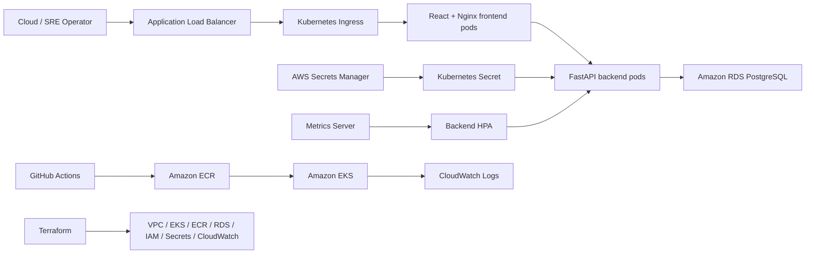

# CloudOps SRE Platform

[](https://github.com/krishna310301/cloudops-sre-platform/actions/workflows/deploy.yml)
[](https://github.com/krishna310301/cloudops-sre-platform/actions/workflows/terraform-validate.yml)

CloudOps SRE Platform is an EKS SRE operations platform for service health, deployment history, incident timelines, MTTR, SLO tracking, and error budget views.

The project is built with React, FastAPI, PostgreSQL, Docker, Helm, Terraform, GitHub Actions, Amazon EKS, Amazon RDS, ALB Ingress, Secrets Manager, CloudWatch, HPA, and k6.

## Why I Built This

Before moving deeper into cloud infrastructure, I worked in production network operations at Tata Communications. My day-to-day work involved SLA-driven troubleshooting, RCA, vendor/TAC coordination, field dispatch, operational handoffs, and high-severity incidents across carrier-grade networks.

That experience shaped how I think about cloud systems. Deploying infrastructure is only one part of the work. The harder question is what happens after something breaks:

- Which services are unhealthy?
- What changed recently?
- Who owns the affected service?
- What is still open?
- How long did recovery take?
- Are reliability targets being tracked?
- Can the platform scale when traffic increases?

CloudOps SRE Platform is the kind of internal tool I would have wanted during live operations: a single place to understand service health, deployments, incidents, timelines, and reliability signals without jumping between disconnected notes and consoles.

## What The Platform Does

- Tracks services with owner, environment, health status, SLO target, service URL, and current version
- Records deployments with service version, commit SHA, deployment status, and deployment time
- Manages incidents with P1-P4 severity, investigation state, timeline updates, resolution, and MTTR
- Shows reliability dashboard metrics for open incidents, failed deployments, average MTTR, service health, SLOs, and error budgets
- Emits structured JSON backend logs with request correlation IDs for troubleshooting
- Includes frontend loading, retry, and API failure states for operational views
- Provides a bounded CPU endpoint for HPA validation under controlled k6 load

## Architecture




More detail: [docs/architecture.md](docs/architecture.md)

## AWS Run Results

The project was deployed to AWS as a short-lived run, then destroyed afterward for cost control. The run used Terraform-managed AWS infrastructure, ECR images, Helm deployment to EKS, RDS PostgreSQL, ALB Ingress, CloudWatch logs, Metrics Server, HPA, and k6.

Key run results:

- EKS cluster was active with two worker nodes
- React and FastAPI workloads were deployed behind ALB Ingress
- Backend used Secrets Manager-backed database credentials
- HPA scaled backend replicas from 2 to 6 pods
- k6 sustained 2,035 requests at a 99.5% success rate with 1.52s p95 latency
- HPA observed 444% CPU against a 60% target during the scale-out window
- Terraform destroy completed after the run to remove EKS, RDS, NAT Gateway, ALB, ECR, CloudWatch log groups, and related networking resources

| Live dashboard | HPA scale-out |
|---|---|
|  |  |

| EKS nodes | Destroy confirmation |
|---|---|
|  |  |

Full gallery: [docs/screenshots/aws-demo-2026-06-06](docs/screenshots/aws-demo-2026-06-06/)

Final results and closure notes: [docs/results.md](docs/results.md)

## Technical Scope

### Application

- React frontend with Vite and production Nginx image
- FastAPI backend with SQLAlchemy, Pydantic, Alembic migrations, and PostgreSQL
- Seeded data for services, incidents, incident timelines, deployments, and health checks
- REST API for service catalog, incident workflows, deployment history, reliability metrics, and health checks

### Kubernetes

- Helm chart for frontend and backend workloads
- Kubernetes Deployments, Services, ConfigMaps, Secrets, Ingress, and HPA
- Liveness and readiness probes
- Resource requests and limits
- ALB Ingress for external traffic
- Metrics Server-backed HPA validation

### AWS

- VPC, public/private/database subnets, route tables, Internet Gateway, and NAT Gateway
- Amazon EKS managed node group
- Amazon ECR repositories for frontend and backend images
- Amazon RDS PostgreSQL in private database subnets
- IAM roles, OIDC provider, and AWS Load Balancer Controller IRSA role
- AWS Secrets Manager database secret
- CloudWatch log groups and RDS CPU alarm

### CI/CD And Validation

- Backend tests
- Frontend production build
- Docker image builds
- Helm lint and Kubernetes manifest validation
- Terraform format and validate
- Terraform cost/security guardrail script
- Checkov Terraform scan
- Manual AWS deployment gate for ECR push and EKS rollout

## Repository Structure

```text
.
├── backend/                 # FastAPI, SQLAlchemy, Alembic, tests, Dockerfile
├── frontend/                # React, Vite, Nginx production image
├── infra/                   # Terraform AWS foundation
├── charts/                  # Helm chart for EKS deployment
├── load-tests/              # k6 HPA load test
├── docs/                    # Architecture, deployment, runbooks, run notes
├── .github/workflows/       # CI/CD and Terraform validation
├── docker-compose.yml       # Local development stack
└── docker-compose.prod.yml  # Production-style local stack
```

## Local Development

Prerequisite:

- Docker Desktop running

Start the local stack:

```bash
docker compose up -d --build
docker compose ps
```

Expected local endpoints:

- PostgreSQL: `localhost:5432`
- FastAPI: `http://localhost:8000`
- React/Vite: `http://localhost:5173`

Verify the backend:

```bash
curl http://localhost:8000/health
curl http://localhost:8000/metrics
```

Run tests and frontend build:

```bash
docker compose exec backend pytest -q
docker compose exec frontend npm run build
```

Expected:

```text
9 passed
✓ built
```

Run migrations manually when developing outside Docker:

```bash
cd backend
alembic upgrade head
```

## Production-Style Local Docker

This stack mirrors the container pattern used for EKS: React builds into static assets, Nginx serves the frontend, and `/api/*` proxies to FastAPI.

```bash
docker compose -f docker-compose.prod.yml up -d --build
docker compose -f docker-compose.prod.yml ps
```

Open:

```text
http://localhost:8080
```

Verify the Nginx API proxy:

```bash
docker compose -f docker-compose.prod.yml exec frontend wget -qO- http://127.0.0.1/api/health
docker compose -f docker-compose.prod.yml exec frontend wget -qO- 'http://127.0.0.1/api/demo/cpu?duration_ms=10'
```

## Terraform Validation

Terraform defines the AWS foundation for short-lived EKS runs:

- VPC and subnets
- EKS cluster and managed node group
- ECR repositories
- RDS PostgreSQL
- Secrets Manager database secret
- IAM roles and policies
- AWS Load Balancer Controller IRSA role
- CloudWatch log groups and alarm

Validate without deploying:

```bash
terraform -chdir=infra init -backend=false
terraform -chdir=infra fmt -check -recursive
terraform -chdir=infra validate
```

Expected:

```text
Success! The configuration is valid.
```

Do not run `terraform apply` until the deploy-day checklist is complete.

Terraform state modes:

- Short-lived single-operator run: local state, with `*.tfstate` ignored by git
- Team-style repeatable deployment: optional S3 backend using [infra/backend.tf.example](infra/backend.tf.example)

Remote state notes: [docs/terraform-state.md](docs/terraform-state.md)

## Helm Validation

If Helm is installed:

```bash
helm lint charts/cloudops-sre-platform -f charts/cloudops-sre-platform/values-aws-example.yaml
helm template cloudops charts/cloudops-sre-platform -f charts/cloudops-sre-platform/values-aws-example.yaml --namespace cloudops
```

If Helm is not installed:

```bash
docker run --rm \
  -v "$PWD:/workspace" \
  -w /workspace \
  alpine/helm:3.15.4 lint charts/cloudops-sre-platform \
  -f charts/cloudops-sre-platform/values-aws-example.yaml
```

Expected:

```text
1 chart(s) linted, 0 chart(s) failed
```

## HPA Load Test

Smoke-test the CPU demo path locally:

```bash
docker run --rm \
  -e BASE_URL="http://host.docker.internal:8080" \
  -e TARGET_PATH="/api/demo/cpu" \
  -e CPU_DURATION_MS="10" \
  -e SMOKE_TEST="true" \
  -v "$PWD/load-tests:/scripts" \
  grafana/k6:0.54.0 run /scripts/k6-load-test.js
```

Expected:

```text
checks: 100%
```

Full HPA runbook: [docs/hpa-demo.md](docs/hpa-demo.md)

## AWS Run And Cleanup

This project is intentionally designed for short-lived AWS runs. The expensive resources are not meant to stay online overnight.

Cost-bearing resources include:

- EKS cluster and worker nodes
- RDS PostgreSQL
- NAT Gateway
- Application Load Balancer
- CloudWatch log ingestion

Before deploying:

1. Run local validation.
2. Confirm AWS account and region.
3. Review `terraform plan`.
4. Apply only when ready to capture run notes and screenshots.
5. Destroy the same day.

Run checklist: [docs/aws-demo-checklist.md](docs/aws-demo-checklist.md)

Run summary: [docs/aws-demo-run.md](docs/aws-demo-run.md)

Cost control: [docs/cost-control.md](docs/cost-control.md)

## Documentation

- [Architecture](docs/architecture.md)
- [Deployment](docs/deployment.md)
- [AWS Add-ons](docs/aws-addons.md)
- [Project Results](docs/results.md)
- [AWS Run Summary](docs/aws-demo-run.md)
- [CI/CD](docs/ci-cd.md)
- [HPA Demo](docs/hpa-demo.md)
- [Observability](docs/observability.md)
- [Runbook](docs/runbook.md)
- [RDS Connectivity And Secret Rotation](docs/rds-connectivity-secret-rotation-runbook.md)
- [External Secrets Sync](docs/external-secrets.md)
- [Optional Grafana Demo](docs/grafana-demo.md)
- [Cost Control](docs/cost-control.md)
- [Validation Checklist](docs/demo-validation-checklist.md)
- [Changelog](docs/changelog.md)

## Follow-Up Paths

The main platform is complete enough to run locally, validate through CI, deploy to EKS, test HPA behavior, inspect logs, and destroy the AWS environment safely.

Optional production-style extensions are documented:

- External Secrets Operator sync for the database URL
- Explicit image promotion and Helm rollback workflow
- Prometheus/Grafana run with kube-prometheus-stack screenshots
