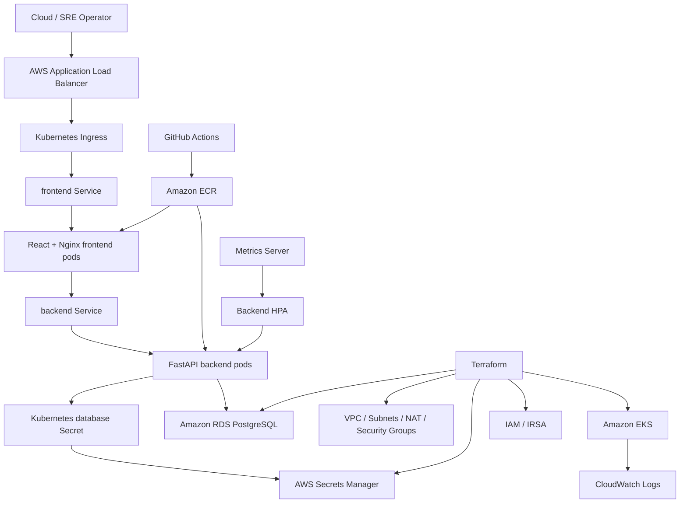

# Architecture

CloudOps SRE Platform is a three-tier reliability operations application packaged for Amazon EKS.

## Logical Architecture

## Runtime Components

### Frontend

- React app built with Vite
- Production image uses Nginx
- Nginx serves static assets
- Nginx proxies `/api/*` to the backend Kubernetes Service named `backend`

### Backend

- FastAPI application
- SQLAlchemy ORM
- PostgreSQL database
- `/health` endpoint for probes
- `/metrics` endpoint for dashboard summaries
- `/demo/cpu` endpoint for bounded HPA load demonstration

### Database

- Local: PostgreSQL in Docker Compose
- AWS: Amazon RDS PostgreSQL in isolated database subnets
- Credentials are generated by Terraform and stored in AWS Secrets Manager

## AWS Infrastructure

Terraform creates:

- VPC with public, private, and database subnets
- Internet Gateway and one NAT Gateway
- EKS cluster and managed node group
- ECR repositories
- RDS PostgreSQL
- Secrets Manager database secret
- IAM roles for EKS control plane and nodes
- OIDC provider for IRSA
- AWS Load Balancer Controller IAM role
- CloudWatch log groups and RDS alarm

## Kubernetes Resources

The Helm chart renders:

- Backend Deployment
- Frontend Deployment
- Backend Service
- Frontend Service
- Backend ConfigMap
- Database Secret reference
- Backend ServiceAccount
- Backend HPA
- Optional ALB Ingress
- Helm test pod

## Traffic Flow

1. User opens the ALB DNS name.
2. ALB routes to the Kubernetes Ingress.
3. Ingress sends traffic to the frontend Service.
4. Nginx serves React assets.
5. React calls `/api/*`.
6. Nginx proxies API traffic to `http://backend:8000`.
7. FastAPI reads/writes reliability data in PostgreSQL.

## Observability Flow

- CloudWatch Observability add-on collects pod logs and cluster telemetry.
- Metrics Server provides CPU data used by the backend HPA.
- HPA behavior can be verified with `kubectl get hpa`, `kubectl top pods`, CloudWatch logs, and load-test screenshots.
- kube-prometheus-stack and Grafana are documented as optional add-ons for deeper Kubernetes dashboards, but were not part of the completed AWS demo evidence run.

## Security And Operations Notes

- RDS is private and not publicly accessible.
- Application containers use ClusterIP services inside Kubernetes.
- ALB is the public entry point.
- Database URL should be loaded from a Kubernetes Secret, which is populated from AWS Secrets Manager during deployment.
- AWS deployment is intentionally short-lived for validation and cost control.
